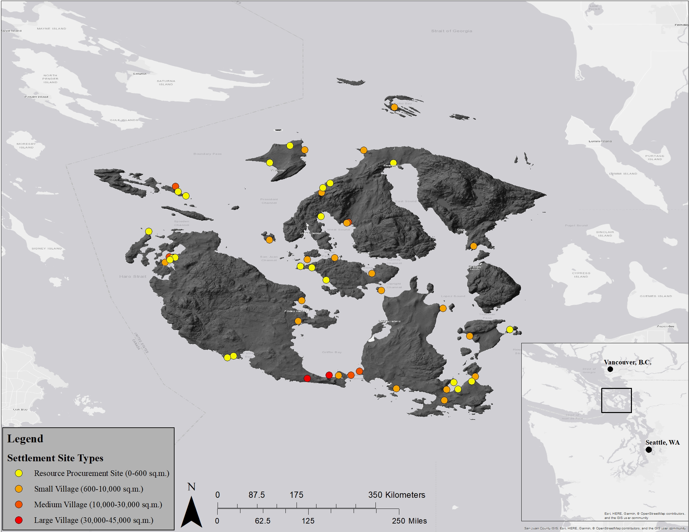

```{r setup, include=FALSE}
knitr::opts_chunk$set(echo = TRUE)
```
Built with `r getRversion()`

## Settlement Change and Political Organization of the San Juan Islands for the Past 3000 Years: R Markdown

This is an R Markdown document which accompanies the paper "Settlement Change and Political Organization of the San Juan Islands for the Past 3,000 Years" by James Brown^a^ and Galen Miller-Atkins^a^, presented at the Northwest Archaeological Conference in Boise 2018. All the R code used for analysis, graphics output, and some brief interpretation of the results is included. This document and data used for the paper is also available on Galen Miller-Atkins' github account at the following [link](www.github.com/GMillerA) in order to facilitate reproducibility. Our hope is that by sharing our data and R code we help contribute to a more free and open-source archaeology. 
^a^-Washington State University

```{r, echo=FALSE, warning=FALSE, error=FALSE}
###load libaries###
library(ggplot2)
library(spatstat)
library(spatstat.local)
library(spatstat.utils)
library(dplyr)
library(sp)
library(lattice)
library(readr)
library(readxl)
```

```{r, echo=FALSE}
#######Nearest Neighbor formulas
source("ScriptNeighbor-2017.txt") 
####Code was developed by Dr. David Brown (WSU)
######
```

###Load San Juan Site Data
```{r, echo=FALSE, warning=FALSE, error=FALSE}
##San Juan Sites
#df <- read.csv("San Juan Site Data.csv")
#df <- read_csv("San Juan Site Data.csv")
#df$`Site Type` <- as.factor(df$`Site Type`)
df <- read_excel("SJ site area and list.xlsx")
df$SiteType <- as.factor(df$SiteType)
```

Site data consists of 51 sites within the San Juan Islands. The dataframe includes site number, latitude, longitude, and site type. Site type is divided into large villages, medium villages, small villages, and resource procurement camps. For the purposes of the bivariate analyses presented below, large and medium sites are aggregated together. All data is collected from previously published sources. Site locations are plotted below. Colors and shapes refer to individual site types. 
San Juan Sites:  

```{r, echo=FALSE, warning=FALSE, error=FALSE}
coordinates(df) <- ~Long+Lat
coords <- c(df$Long, df$Lat)
#SpatialPointsDataFrame(coords, df)
#df.win <- owin(c(-123.17729, -122.82739), c(48.43756, 48.71679))
df.win <- owin(c(-123.17729, -122.7822), c(48.43652, 48.75746))
#df.ppp <- ppp(df$Longitude, df$Latitude, window = df.win, marks = df$`Site Type`)
df.ppp <- ppp(df$Long, df$Lat, window = df.win, marks = df$Category)
## coloured points plot with legend in plotting area and scales:
# par(bg="white")
# plot(df.ppp, col=c("darkblue","darkred", "darkgreen"),pch=1, lwd=2,
#      main = "San Juan Site Types", xlab = "Longitude", ylab="Latitude")
plot.ppp(df.ppp, cols = c("darkblue","darkred", "darkgreen"),
         main = "San Juan Site Types")
# legend(
#   "topright",
#   lty=1,
#   col=c("darkblue","darkred", "darkgreen"), 
#   legend = c("LV", "SV", "RPC")
# )
```

###Set Up Analyses
Once data is uploaded into the proper format, a study area must be constructed in "owin" format and then data must be divided into new dataframes for each site type. The study area is the "bbox", or smallest rectangular area, containing each site. The output below includes the df.win, or the study area window, and dataframe of class "ppp" for each site type. 

```{r, echo=FALSE, warning=FALSE, error=FALSE}
###Set Up Window#####
bbox(df)
df.win <- owin(c(-123.17729, -122.7822), c(48.43652, 48.75746))
# #Small Village
# sv <- df[which(df$`Site Type`=="Small Village"),]
# sv.ppp <- ppp(sv$Longitude, sv$Latitude, window = df.win)
# #Large Village
# lv <- df[which(df$`Site Type`=="Large Village"),]
# lv.ppp <- ppp(lv$Longitude, lv$Latitude, window = df.win)
# #Resource Procurement Camps
# rp <- df[which(df$`Site Type`=="Resource Procurement Camp"),]
# rp.ppp <- ppp(rp$Longitude, rp$Latitude, window = df.win)
```

##Bivariate Point Pattern Analyses
Two sets of bivariate point pattern analyses were conducted, G-cross and L-cross tests. The function nb.cross calls functions for Gcross [Gcross](https://www.rdocumentation.org/packages/spatstat/versions/1.55-0/topics/Gcross) and Kcross [Kcross](https://www.rdocumentation.org/packages/spatstat/versions/1.55-0/topics/Kcross). In-depth descriptions for each function are provided in Brown and Miller-Atkins (2018). Briefly, the G-cross function investigates one-way interactions by measuring the proportion of *j* sites within *r* radius from *i* sites and vice versa. In other words, G-cross tests whether *i* sites aggregate near *j* sites or are repelled by them. It is possible that one site may be distributed randomly with respect to another site type, while the reverse is not true. In order to test this possibility, both G~i,j and G~j,i are conducted. L-cross tests for interaction effects over multiple spatial scales and measures the number of opposite type neighbors within each *r* radius. L-cross is the weighted average of K~i,j and K~j,i so multiple tests are not conducted. The Gcross function includes an edge correction using the Kaplan-Meier estimator and the Lcross function uses an isotropic edge correction. The "ScriptNeighbor-2017.txt" script includes additional documentation and descriptions for each function. 
Each graph includes a simulation envelope of 199 Monte Carlo simulations, where the site locations are randomly distributed and G or L-cross is calculated. The maximum and minimum values from the set of 199 simulations are plotted to the form the maximum and minimum extent of the simulation envelope. The red dotted line represents the mean of the simulation envelope. If the empirical test lies outside of the envelope, this represents a significant difference, p < .005. 

###Small Villages to Large Villages
```{r, echo=FALSE, warning=FALSE, error=FALSE, message=FALSE}
####Small to Large
sv_lv <- df[which(df$SiteType=="Small" | df$SiteType=="Large"),]
sv_lv$SiteType <- factor(sv_lv$SiteType)
sv_lv.ppp <- ppp(sv_lv$Long, sv_lv$Lat, marks = sv_lv$SiteType, window = df.win)

nb.cross(sv_lv.ppp, title = "Small vs Large and Medium Villages")
```


All plots show the empirical G and L-cross are well-within the simulation envelope. These results show no support to reject the null hypothesis, complete spatial randomness (CSR). In other words, small and medium-to-large villages are distributed randomly with respect to the other. 

###Small Villages to Resource Procurement Camps
```{r, echo=FALSE, warning=FALSE, error=FALSE, message=FALSE}
####Small to Resource
sv_rp <- df[which(df$SiteType=="Small" | df$SiteType=="RP"),]
sv_rp$SiteType <- factor(sv_rp$SiteType)
sv_rp.ppp <- ppp(sv_rp$Long, sv_rp$Lat, marks = sv_rp$SiteType, window = df.win)

nb.cross(sv_rp.ppp, title = "Small Village vs Resource Camps")
```


As in the previous case, there is no evidence to reject the null hypothesis of CSR; there are no significant one-way interaction effects between small villages and resource procurement camps. 

###Large Villages to Resource Procurement Camps
```{r, echo=FALSE, warning=FALSE, error=FALSE, message=FALSE}
####Large to Resource
rp_lv <- df[which(df$SiteType=="RP" | df$SiteType=="Large"),]
rp_lv$Sitetype <- factor(rp_lv$SiteType)
rp_lv.ppp <- ppp(rp_lv$Long, rp_lv$Lat, marks = rp_lv$SiteType, window = df.win)

nb.cross(rp_lv.ppp, title = "Resource Camps vs Large and Medium Villages")
```


There is no evidence to suggest there are one-way interaction effects between large villages and resouce procurement camps. 


##Discussion
None of the results provide evidence to reject the null hypothesis of CSR. In other words, all site types are distributed randomly *with respect to each other*. Univariate results may provide different results. In terms of archaeological interpretation, we have no evidence to suggest that site types are organized with respect to each other. If settlment organization is a suitable proxy for political complexity and/or hierarchical decision making, one would expect the distribution of sites and site types to either aggregate or be dispersed from other sites; one can imagine how small villages may be distributed regularly around large villages, for example. With the data used here, we find no evidence of that kind of settlement organization.  


