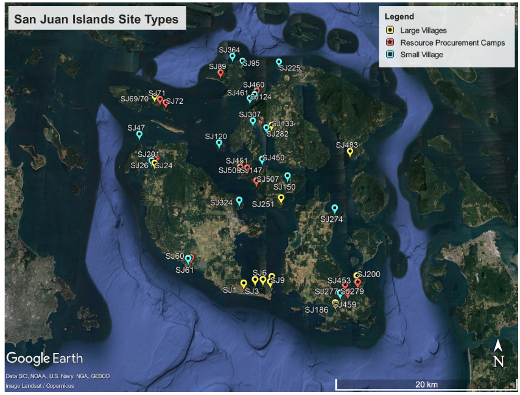

Built with `r getRversion()`
```{r setup, include=FALSE}
knitr::opts_chunk$set(echo = TRUE)
```

## Politics on the Landscape: Evaluating Settlement Organization in the San Juan Islands: R Markdown

This is an R Markdown document which accompanies the paper "Politics on the Landscape: Evaluating Settlement Organization in the San Juan Islands" by Galen Miller-Atkins^a^ and James Brown^a^, presented at the Northwest Archaeological Conference in Boise 2018. All the R code used for analysis, graphics output, and some brief interpretation of the results is included. This document and data used for the paper is also available on Galen Miller-Atkins' github account at the following [link](https://www.github.com/GMillerA) in order to facilitate reproducibility. Our hope is that by sharing our data and R code we help contribute to a more free and open-source archaeology. 
^a^-Washington State University

###Load Libraries
```{r, echo=FALSE, warning=FALSE, error=FALSE}
###load libaries###
library(ggplot2)
library(spatstat)
library(dplyr)
library(sp)
library(spdep)
library(lattice)
library(readxl)
library(ncf)
library(readr)
```

```{r, echo=FALSE}
#######Nearest Neighbor formulas
source("ScriptNeighbor-2017.txt") 
source("lattice508-script.txt")
####Code was developed by Dr. David Brown (WSU)
######
```

###Load San Juan Site Data
```{r, echo=FALSE, warning=FALSE, error=FALSE}
# df <- read_csv("San Juan Site Data.csv")
# df$`Site Type` <- as.factor(df$`Site Type`)
df <- read_excel("SJ site area and list.xlsx")
#df2 <- read_excel("SJ site area and list.xlsx")
df$SiteType <- as.factor(df$SiteType)
```

Site data consists of 51 sites within the San Juan Islands. The dataframe includes site number, latitude, longitude, and site type. Site type is divided into large villages, medium villages, small villages, and resource procurement sites. For the purposes of the analyses presented below, medium and large sites are aggregated together under "large" sites. All data is collected from previously published sources. Site locations are presented overlaid on a Google Earth picture and plotted below within the study area. Colors and shapes refer to individual site types. 

San Juan Sites:  

```{r, echo=FALSE, warning=FALSE, error=FALSE}
coordinates(df) <- ~Long+Lat
coords <- c(df$Long, df$Lat)
#df.win <- owin(c(-123.8562, -122.472), c(48.26523, 48.715))
df.win <- owin(c(-123.17729, -122.7822), c(48.43652, 48.75746))
df.ppp <- ppp(df$Long, df$Lat, window = df.win, marks = df$SiteType)
#Small Village
sv <- df[which(df$SiteType=="Small"),]
sv$SiteType <- factor(sv$SiteType)
sv.ppp <- ppp(sv$Long, sv$Lat, window = df.win)
#Large Village
lv <- df[which(df$SiteType=="Large"),]
lv$SiteType <- factor(lv$SiteType)
lv.ppp <- ppp(lv$Long, lv$Lat, window = df.win)
#Resource Procurement Camps
rp <- df[which(df$SiteType=="RP"),]
rp$SiteType <- factor(rp$SiteType)
rp.ppp <- ppp(rp$Long, rp$Lat, window = df.win)
#Plot all sites
plot.ppp(df.ppp, cols = c("darkblue","darkred", "darkgreen"),
         main = "San Juan Site Types")
```

##Point Pattern Analyses

Two point pattern analyses were conducted: Besag's L-function (a transformation of Ripley's K-function) and the local L-function. Documentation for each is detailed in the following links respectively: [Lest](https://www.rdocumentation.org/packages/spatstat/versions/1.55-0/topics/Lest) and [LocalL](https://www.rdocumentation.org/packages/spatstat/versions/1.54-0/topics/localK). A more detailed treatment of each analysis is given in Miller-Atkins and Brown (2018). Briefly, the L-function is a transformation of Ripley's K-function, which aids in interpretation, where: $$L(r) = \sqrt(K(r) / \pi)$$. In essence, the Ripley's K and Besag's L count the number of neighboring points within radius *r*, compared to a completely random point pattern with the same number of points. Whereas first-order point pattern analyses, such as G and F, determine the distance to nearest neighbors, K and L investigate the *intensity* of the point pattern at multiple spatial scales; in other words, K and L test whether points are distributed homogeneously through space or if density changes over space. The expected distribution is given by $$K(r) = \pi * r^{2}$$. The local L-function operates in much the same way, except each point receives an L-value at each radius *r*. In this way, one can see if specific points are outliers and how they, as a whole, contribute to the global estimate. The summed values of each point contribute to the global L-function. 
Each L-function graph includes a simulation envelope of 99 Monte Carlo simulations, where the site locations are randomly distributed and the L-function is calculated. The maximum and minimum values from the set of 99 simulations are plotted to the form the maximum and minimum extent of the simulation envelope. The red dotted line represents the theoretical, expected L-values for a random poisson point pattern. If the empirical test lies outside of the envelope, this represents a significant difference, p < .01. 
Of note, the *r* values presented here represent degrees, not meters. 

###L-function Results

#####All Sites
```{r, echo=FALSE, warning=FALSE, error=FALSE}
plot(envelope(df.ppp, Lest, funargs = (correction="isotropic")),
     main = "L-function \nSan Juan Sites")
```

One can see that, taken as a whole, sites in the San Juan Islands are significantly clustered from around 0*r* to about .04*r*. The observed L-values are well outside the simulation envelope, achieving a p value < .01. At the largest spatial scales, the sites are no longer significantly clustered; from about .05*r* and larger, sites are randomly distributed across the study area. Ignoring site types, the San Juan sites are distributed significantly close to one another. 

#####Small Villages
```{r, echo=FALSE, warning=FALSE, error=FALSE}
plot(envelope(sv.ppp, Lest, funargs = (correction="isotropic")),
     main = "L-function \nSmall Villages")
```

Analyzing only the small villages within the study area, one can see that the distribution of sites lies completely within the simulation envelope. There is no evidence to reject the null hypothesis of complete spatial randomness (CSR); the data can be described by a random poisson process. 

#####Large Villages
```{r, echo=FALSE, warning=FALSE, error=FALSE}
plot(envelope(lv.ppp, Lest, funargs = (correction="isotropic")),
     main = "L-function \nLarge and Medium Villages")
```

The distribution of large and medium villages shows that there is little evidence to reject CSR. There are a few values that lie outside the simulation envelope but they quickly return and the pattern does not hold. Much like the small villages, large and medium villages are not clustered together but randomly distributed across the study area. 

#####Resource Procurement Camps
```{r, echo=FALSE, warning=FALSE, error=FALSE}
plot(envelope(rp.ppp, Lest, funargs = (correction="isotropic")),
     main = "L-function \nResource Procurement Sites")
```

The L-function results for the resource procurement sites offer some evidence to reject the null hypothesis of CSR, in favor of significant clustering at small spatial scales. From .005*r* to .02*r* resource procurement sites are significantly clustered around each other. As one increases the spatial scale beyond .02*r*, the distribution of resource procurement sites could be described by a random poisson process. These results suggest two things: resource procurement sites may cluster around specific geographic areas (not too surprising) and the distribution of resource sites is statistically different from other site types. 

###Local-L Results
####All San Juan Sites
```{r, echo=FALSE, warning=FALSE, error=FALSE}
L.df.ppp <- localL(df.ppp)
# plot(L.df.ppp, main = "Local L \nSan Juan Sites", legend = FALSE, 
#      col = as.factor(df$SiteType))
# abline(c(0,1), col="black", lty=3)
# legend(
#   "topright",
#   lty=1,
#   col=c("black","darkred", "darkgreen"),
#   legend = c("LV", "SV", "RPC")
# )
L.sv.ppp <- localL(sv.ppp)
L.lv.ppp <- localL(lv.ppp)
L.rp.ppp <- localL(rp.ppp)
par(mfrow = c(1,3))
plot(L.sv.ppp, col="red", lty=1, legend = FALSE, 
     main = "Local L \nSmall Villages")
abline(c(0,1), col="black", lty=1)
plot(L.lv.ppp, col="blue", lty=1, legend = FALSE, 
     main = "Local L \nLarge and Medium Villages")
abline(c(0,1), col="black", lty=1)
plot(L.rp.ppp, col="green", lty=1, legend = FALSE, 
     main = "Local L \nResource Procurement Camps")
abline(c(0,1), col="black", lty=1)
par(mfrow = c(1,1))

```

The above figure shows the Local-L results for each site, colored by site type. Red represents large villages, blue for small villages, and green for resource procurement sites. One can see that, while large villages and resource procurement sites are generally more clustered (i.e. above the expected line) at small spatial scales, some small villages are regularly-spaced or dispersed at very large spatial scales. For example, a number of small villages do not have any neighbors within .04*r*. At the extreme, one small village does not share a neighbor until about .07*r*. By analyzing the local-L results for each site, one can document these outliers and investigate how site types may have variation in the spatial patterns. 
Below the local-L results are shown for one site for each site type. The red dotted line represents the expected distribution under CSR. Note that the y-axes are not the same for each site.

```{r, echo=FALSE, warning=FALSE, error=FALSE}
par(mfrow = c(1,3))
plot(L.df.ppp, iso01~r, main = "Local L \nS1-Large Village") 
abline(c(0,1), col="red", lty=2)
plot(L.df.ppp, iso17~r, main = "Local L \nSJ186-Small Village") 
abline(c(0,1), col="red", lty=2)
plot(L.df.ppp, iso31~r, main = "Local L \nSJ26-Resource Procurement") 
abline(c(0,1), col="red", lty=2)
par(mfrow = c(1,1))
```


###Local-L Contour Plots
Following (Getis and Franklin 1987), one can create contour plots for the local-L results, given a certain *r* value. These contour plots, much like topographic maps or heatmaps, can help illustrate the location and shape of similar values in space. For example, at small spatial scales (e.g. less than .01*r*), are sites inland more clustered than sites on the coast, or vice versa?  By varying the *r* values, one can examine whether these clusters and spatial trends stay the same or change. If the spatial trends change, this may indicate that sthere are multiple processes acting at different spatial scales. One may think of how cultural factors may pattern artifacts or sites over large spatial scales, whereas certain geological processes may pattern artifacts over very small spatial scales. 
Here, contour plots are made for .01, .04, .07*r* in order to investigate small, medium, and large spatial scales, relative to the overall study area. Note that the y-axis values are not the same for each contour plot. 

####All Sites
```{r, echo=FALSE, warning=FALSE, error=FALSE}
##Vary distances
L01 <- localL(df.ppp, rvalue=.01)
L04 <- localL(df.ppp, rvalue=.04)
L07 <- localL(df.ppp, rvalue=.07)
X01 <- df.ppp %mark% L01
X04 <- df.ppp %mark% L04
X07 <- df.ppp %mark% L07
#Contour Plots
#par(mfrow=c(1,3))
###Small Sites r.01
Z01 <- Smooth(X01, sigma=2, dimyx=128)
plot(Z01, col=topo.colors(128), main="San Juan Sites \nr=.01")
contour(Z01, add=TRUE)
points(df.ppp, pch=16, cex=0.5)
###Small Sites r.04
Z04 <- Smooth(X04, sigma=2, dimyx=128)
plot(Z04, col=topo.colors(128), main="San Juan Sites \nr=.04")
contour(Z04, add=TRUE)
points(df.ppp, pch=16, cex=0.5)
###Small Sites r.07
Z07 <- Smooth(X07, sigma=2, dimyx=128)
plot(Z07, col=topo.colors(128), main="San Juan Sites \nr=.07")
contour(Z07, add=TRUE)
points(df.ppp, pch=16, cex=0.5)
```

Only the resource procurement sites and aggregating all the available sites in the San Juan Islands yielded statistically significant L-function results. Because the sum of the local-L values contribute to the "global" L, the contour plots for all SJ sites and resource procurement sites should be taken as suggesting more significant evidence than the small and large villages. 

The contour plots for do not significant show changes in spatial trends across all three scales (i.e. areas of highest clustering change with spatial scale). This may suggest that one process is driving the clustering across the entire study area, operating in a similar way across all spatial scales. In each *r* investigated here, sites in the South-Southwest are the most clustered, with a general spatial trend of East to West. Sites in the East are more dispersed than their western counterparts. This insight may help elucidate potential outliers and differences between these sites.  

####Small Villages
```{r, echo=FALSE, warning=FALSE, error=FALSE}
##Vary distances
L01 <- localL(sv.ppp, rvalue=.01)
L04 <- localL(sv.ppp, rvalue=.04)
L07 <- localL(sv.ppp, rvalue=.07)
X01 <- sv.ppp %mark% L01
X04 <- sv.ppp %mark% L04
X07 <- sv.ppp %mark% L07
#Contour Plots
#par(mfrow=c(1,3))
###Small Sites r.01
Z01 <- Smooth(X01, sigma=2, dimyx=128)
plot(Z01, col=topo.colors(128), main="Small Villages \nr=.01")
contour(Z01, add=TRUE)
points(sv.ppp, pch=16, cex=0.5)
###Small Sites r.04
Z04 <- Smooth(X04, sigma=2, dimyx=128)
plot(Z04, col=topo.colors(128), main="Small Villages \nr=.04")
contour(Z04, add=TRUE)
points(sv.ppp, pch=16, cex=0.5)
###Small Sites r.07
Z07 <- Smooth(X07, sigma=2, dimyx=128)
plot(Z07, col=topo.colors(128), main="Small Villages \nr=.07")
contour(Z07, add=TRUE)
points(sv.ppp, pch=16, cex=0.5)
```

At the smallest spatial scale, .01*r*, small villages are consistently dispersed from one another; there are no neighbors within that radius. This distribution is not statistically significant but it does illustrate potential inhibition processes between small villages across the islands. Increasing the spatial scale to .04*r* and .07*r* show a clustering trend from northwest to southeast. It is interesting to note that this is the opposite of the trend for all sites aggregated together. Small villages may be outliers relative to other site types. It may be valuable to investigate if northern villages contain different assemblage characteristics than southern ones or if there are some ecological factors at work. 

####Large Villages
```{r, echo=FALSE, warning=FALSE, error=FALSE}
##Vary distances
L01 <- localL(lv.ppp, rvalue=.01)
L04 <- localL(lv.ppp, rvalue=.04)
L07 <- localL(lv.ppp, rvalue=.07)
X01 <- lv.ppp %mark% L01
X04 <- lv.ppp %mark% L04
X07 <- lv.ppp %mark% L07
#Contour Plots
#par(mfrow=c(1,3))
###Large Sites r.01
Z01 <- Smooth(X01, sigma=2, dimyx=128)
plot(Z01, col=topo.colors(128), main="Large and Medium Villages \nr=.01")
contour(Z01, add=TRUE)
points(lv.ppp, pch=16, cex=0.5)
###Large Sites r.04
Z04 <- Smooth(X04, sigma=2, dimyx=128)
plot(Z04, col=topo.colors(128), main="Large and Medium Villages \nr=.04")
contour(Z04, add=TRUE)
points(lv.ppp, pch=16, cex=0.5)
###Large Sites r.07
Z07 <- Smooth(X07, sigma=2, dimyx=128)
plot(Z07, col=topo.colors(128), main="Large and Medium Villages \nr=.07")
contour(Z07, add=TRUE)
points(lv.ppp, pch=16, cex=0.5)
```

The large villages show changing spatial clustering trends at different spatial scales. At the smallest spatial scale, *r* = .01, the trend goes from East to West, increasing the degree of clustering. At .04*r* and .07*r*, the trend changes to a North to South direction. At small scales, sites on the western-most side of the islands are the most clustered. At larger scales (increasing the "search radius"), sites in the southeastern section of the study area are the most clustered. This may suggest that there are two separate processes, operating at different spatial scales, distributing sites in different ways. Sites on the western-most area may be the result of different behaviors and/or across the entire set of San Juan islands there is a preference for settling on the southeastern area. 

####Resource Procurement Sites
```{r, echo=FALSE, warning=FALSE, error=FALSE}
##Vary distances
L01 <- localL(rp.ppp, rvalue=.01)
L04 <- localL(rp.ppp, rvalue=.04)
L07 <- localL(rp.ppp, rvalue=.07)
X01 <- rp.ppp %mark% L01
X04 <- rp.ppp %mark% L04
X07 <- rp.ppp %mark% L07
#Contour Plots
#par(mfrow=c(1,3))
###RP Sites r.01
Z01 <- Smooth(X01, sigma=2, dimyx=128)
plot(Z01, col=topo.colors(128), main="Resource Procurement \nr=.01")
contour(Z01, add=TRUE)
points(rp.ppp, pch=16, cex=0.5)
###RP Sites r.04
Z04 <- Smooth(X04, sigma=2, dimyx=128)
plot(Z04, col=topo.colors(128), main="Resource Procurement \nr=.04")
contour(Z04, add=TRUE)
points(rp.ppp, pch=16, cex=0.5)
###RP Sites r.07
Z07 <- Smooth(X07, sigma=2, dimyx=128)
plot(Z07, col=topo.colors(128), main="Resource Procurement \nr=.07")
contour(Z07, add=TRUE)
points(rp.ppp, pch=16, cex=0.5)
```


Comparing the contour plots across each of the radii, one can see a broad pattern from West to East. The stability of this pattern and the significant global L results suggest that there is one, statistically significant process driving the distribution of resource procurement sites across the San Juan Islands. This is most likely the result of resource acquisition; multiple camps are surrounding specific, discrete resource locations. The difference between resource procurement sites and the other site types illustrates how these analyses can differentiate between cultural factors such as settlement organization. 

##Tests of Spatial Autocorrelation

The point pattern results help formulate further questions. For example, if particular site types are significantly clustered, do adjacent areas (e.g. islands) share similar numbers of sites. The answers to these kinds of questions may help point to certain ecological or cultural factors, determining where sites are located and in what quantity. The following methods used to address this question are taken broadly from Fletcher (2008). Fletcher (2008) developed a similar methodology in order to test whether the settlement organization in Neolithic Israel was the result of independent communities or incipient chiefdoms. 
There are two major tests conducted: Moran's I and Geary's C. A detailed description of each test is given in Miller-Atkins and Brown (2018). Each of these measures test whether there is significant spatial autocorrelation across the data set. Positive autocorrelation suggests that nearby quadrats contain similar counts of sites. Negative autocorrelation suggests that nearby quadrats are extremely dissimilar in terms of site density. By varying the spatial lag, or distance in which one considers another site a "neighbor", one can investigate if the direction and degree of autocorrelation changes with the spatial scale of analysis. Both Moran's I and Geary's C are lattice-based autocorrelation measures and require an x,y, and z value, so the overall study area is divided into different numbers of square quadrats (3x3, 5x5, 8x8, and 10x10). Varying the size of the quadrats also allows for one to test whether the "resolution" of the data (coarse to fine grain) changes the results significantly. 
Because these analyses are sensitive to zero values and the overall count of sites, we restrict our methods to only using the aggregate data set; we don't separate our tests by site type here. We welcome others to try this and investigate whether the overall results change significantly. 
There are many different ways of how to decide whether adjacent quadrats are "neighbors". We consider both a "rook" neighborhood (nearest four quadrats, excluding the diagonals) and "queen" (von Neumann neighborhood, diagonals are included). The null hypothesis for all tests is no autocorrelation and the alternate hypothesis is positive autocorrelation. 
A heatmap is also presented in order to show the quadrats used and the relative number of sites in each. White represents zero and red represents a high number of sites. 


####Moran's I

#####3x3
```{r, echo=FALSE, warning=FALSE, error=FALSE}
nx = 3
ny = 3
quadcounts <- quadratcount(df.ppp, nx=nx, ny=ny)
df.mat <- matrix(quadcounts, nrow = ny, ncol=nx)
image.mat(df.mat)
lattice.508(df.mat, type = "I", Ha = "pos", ntype = "rook")
lattice.508(df.mat, type = "I", Ha = "pos", ntype = "queen")
```

#####5x5
```{r, echo=FALSE, warning=FALSE, error=FALSE}
nx = 5
ny = 5
quadcounts <- quadratcount(df.ppp, nx=nx, ny=ny)
df.mat <- matrix(quadcounts, nrow = ny, ncol=nx)
image.mat(df.mat)
lattice.508(df.mat, type = "I", Ha = "pos", ntype = "rook")
lattice.508(df.mat, type = "I", Ha = "pos", ntype = "queen")
```


#####8x8
```{r, echo=FALSE, warning=FALSE, error=FALSE}
nx = 8
ny = 8
quadcounts <- quadratcount(df.ppp, nx=nx, ny=ny)
df.mat <- matrix(quadcounts, nrow = ny, ncol=nx)
image.mat(df.mat)
lattice.508(df.mat, type = "I", Ha = "pos", ntype = "rook")
lattice.508(df.mat, type = "I", Ha = "pos", ntype = "queen")
```


#####10x10
```{r, echo=FALSE, warning=FALSE, error=FALSE}
nx = 10
ny = 10
quadcounts <- quadratcount(df.ppp, nx=nx, ny=ny)
df.mat <- matrix(quadcounts, nrow = ny, ncol=nx)
image.mat(df.mat)
lattice.508(df.mat, type = "I", Ha = "pos", ntype = "rook")
lattice.508(df.mat, type = "I", Ha = "pos", ntype = "queen")
```

There is no evidence to reject the null hypothesis under any of the conditions investigated here. In other words, the number of sites is distributed randomly across the study area, indicating there is no spatial trend or preference for site location. This may suggest the high density of sites indicated by the clustering tests is a very "local" process. 

###Geary's C
####3x3
```{r, echo=FALSE, warning=FALSE, error=FALSE}
nx = 3
ny = 3
quadcounts <- quadratcount(df.ppp, nx=nx, ny=ny)
df.mat <- matrix(quadcounts, nrow = ny, ncol=nx)
image.mat(df.mat)
lattice.508(df.mat, type = "C", Ha = "pos", ntype = "rook")
lattice.508(df.mat, type = "C", Ha = "pos", ntype = "queen")
```

####5x5
```{r, echo=FALSE, warning=FALSE, error=FALSE}
nx = 5
ny = 5
quadcounts <- quadratcount(df.ppp, nx=nx, ny=ny)
df.mat <- matrix(quadcounts, nrow = ny, ncol=nx)
image.mat(df.mat)
lattice.508(df.mat, type = "C", Ha = "pos", ntype = "rook")
lattice.508(df.mat, type = "C", Ha = "pos", ntype = "queen")
```

####8x8
```{r, echo=FALSE, warning=FALSE, error=FALSE}
nx = 8
ny = 8
quadcounts <- quadratcount(df.ppp, nx=nx, ny=ny)
df.mat <- matrix(quadcounts, nrow = ny, ncol=nx)
image.mat(df.mat)
lattice.508(df.mat, type = "C", Ha = "pos", ntype = "rook")
lattice.508(df.mat, type = "C", Ha = "pos", ntype = "queen")
```

####10x10
```{r, echo=FALSE, warning=FALSE, error=FALSE}
nx = 10
ny = 10
quadcounts <- quadratcount(df.ppp, nx=nx, ny=ny)
df.mat <- matrix(quadcounts, nrow = ny, ncol=nx)
image.mat(df.mat)
lattice.508(df.mat, type = "C", Ha = "pos", ntype = "rook")
lattice.508(df.mat, type = "C", Ha = "pos", ntype = "queen")
```

###Correlograms

Correlograms are plots of autocorrelation, varying the spatial lag on the x-axis. These plots can show how the degree and direction of autocorrelation varies with the spatial scale of analysis. For example, are sites far away more "related" than sites close together or vice versa?
The correlograms presented below use the 10x10 quadrat counts. This is was chosen in order to aid in identifying how changing the neighborhood size may change the degree of autocorrelation. If using 3x3 quadrats, for instance, one could only see two different spatial lags. Other people are welcome to see if changing this parameter significantly changes the results. 
Again, two different neighborhood types are used: rook and queen. 

####Moran's I
#####Rook
```{r, echo=FALSE, warning=FALSE, error=FALSE}
nx = 10
ny = 10
quadcounts <- quadratcount(df.ppp, nx=nx, ny=ny)
df.mat <- matrix(quadcounts, nrow = ny, ncol=nx)
x.coord <- rep(1:nx, each=nx)
y.coord <- rep(1:ny, times=ny)
xy <- data.frame(x.coord, y.coord)
r.nb <- cell2nb(10,10,type = "rook", torus = FALSE)
sp.cor <- sp.correlogram(r.nb, as.vector(df.mat), order=5,
                         method="I", randomisation=FALSE)
plot(sp.cor, main = "Moran's I (Rook) Correlogram \nSan Juan Site Counts")
print(sp.cor)
```

#####Queen
```{r, echo=FALSE, warning=FALSE, error=FALSE}
nx = 10
ny = 10
quadcounts <- quadratcount(df.ppp, nx=nx, ny=ny)
df.mat <- matrix(quadcounts, nrow = ny, ncol=nx)
x.coord <- rep(1:nx, each=nx)
y.coord <- rep(1:ny, times=ny)
xy <- data.frame(x.coord, y.coord)
r.nb <- cell2nb(10,10,type = "queen", torus = FALSE)
sp.cor <- sp.correlogram(r.nb, as.vector(df.mat), order=5,
                         method="I", randomisation=FALSE)
plot(sp.cor, main = "Moran's I (Queen) Correlogram \nSan Juan Site Counts")
print(sp.cor)
```

The only significant result comes from the Moran's I (queen neighborhood) at the highest spatial lag (p<.1). This suggests that there is some evidence to reject the null hypothesis, but only with neighbors very far away. Areas close together still do not exhibit similar counts of sites. 


####Geary's C
#####Rook
```{r, echo=FALSE, warning=FALSE, error=FALSE}
nx = 10
ny = 10
quadcounts <- quadratcount(df.ppp, nx=nx, ny=ny)
df.mat <- matrix(quadcounts, nrow = ny, ncol=nx)
x.coord <- rep(1:nx, each=nx)
y.coord <- rep(1:ny, times=ny)
xy <- data.frame(x.coord, y.coord)
r.nb <- cell2nb(10,10,type = "rook", torus = FALSE)
sp.cor <- sp.correlogram(r.nb, as.vector(df.mat), order=5,
                         method="C", randomisation=FALSE)
plot(sp.cor, main = "Geary's C (Rook) Correlogram \nSan Juan Site Counts")
print(sp.cor)
```

#####Queen
```{r, echo=FALSE, warning=FALSE, error=FALSE}
nx = 10
ny = 10
quadcounts <- quadratcount(df.ppp, nx=nx, ny=ny)
df.mat <- matrix(quadcounts, nrow = ny, ncol=nx)
x.coord <- rep(1:nx, each=nx)
y.coord <- rep(1:ny, times=ny)
xy <- data.frame(x.coord, y.coord)
r.nb <- cell2nb(10,10,type = "queen", torus = FALSE)
sp.cor <- sp.correlogram(r.nb, as.vector(df.mat), order=5,
                         method="C", randomisation=FALSE)
plot(sp.cor, main = "Geary's C (Queen) Correlogram \nSan Juan Site Counts")
print(sp.cor)
```

Overall, the Geary's C results also suggest that nearby areas do not contain similar counts of sites and far away areas do. The results do offer more evidence to reject the null hypothesis. For example, the Geary's C result with a rook neighborhood at a spatial lag of 3 has a p value < .05. These results are quite suggestive of significant patterning but they should be taken in context with the Moran's I results. Geary's C is sensitive to local autocorrelation not investigated here and the high number of zeros may affect the results. Both of these issues may be investigated by others or the authors in the future. 

##Discussion
The results of the point pattern analyses and the autocorrelation tests both suggest that site distribution and site counts may follow very "local" processes and there is little evidence to suggest a hierarchical site distribution, with intense population centers and "periphery" areas. Instead, we find that a decentralized, dispersed population with separate clusters of sites more appropriately fits the data. Further work would greatly benefit from investigating how the spatial trends identified in the local-L results and any spatial autocorrelation in site counts may be driven by ecological factors. 